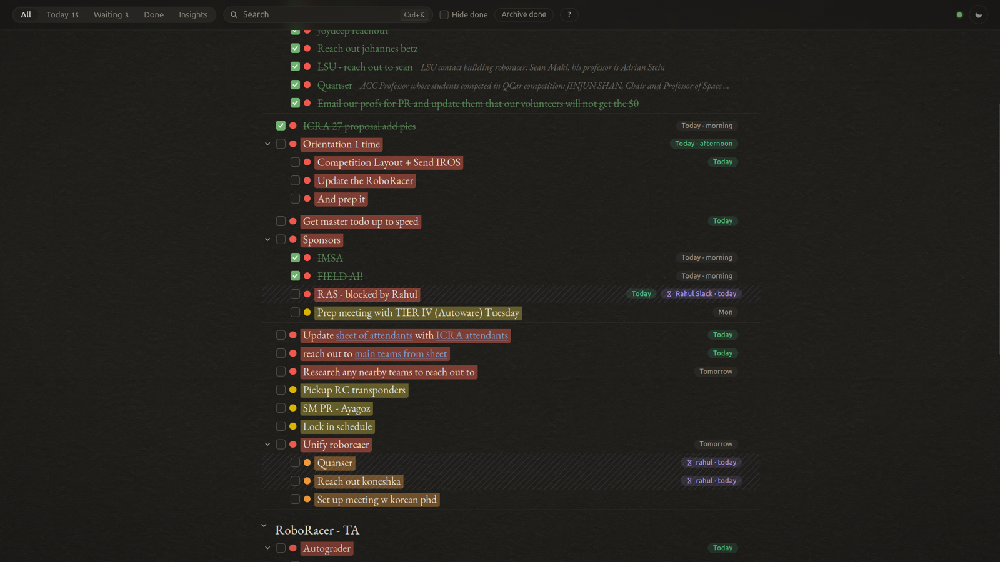

# todo

A local, keyboard-first todo outliner that looks like a sheet of paper. Sections and
nested tasks, highlighter priorities, due dates, notes, links, "waiting on" flags,
undo everywhere, and an Insights tab with a year of activity and a slider to see the
list as it was on any past day.

Stdlib Python + vanilla JS, **no dependencies, nothing leaves your machine**: the
server binds to `127.0.0.1` only. Data lives in `data/todo.db` (sqlite) with a
readable mirror in `data/todo.md` regenerated on every change.

## Run

Always on (user service, starts at login):

    systemctl --user enable --now todo      # once
    systemctl --user restart todo           # after editing the code

Or by hand: `python3 server.py` → http://127.0.0.1:5757

Tests: `python3 -m unittest discover -s tests -v`

## Keys

| key | action |
|---|---|
| Enter | new item below (splits at cursor); on a heading: first child |
| Backspace on empty | delete item |
| Tab / Shift+Tab | nest / un-nest (works from the checkbox, dot or menu too) |
| Alt+↑ / Alt+↓ | move up / down (hops out of / into neighbouring sections) |
| Ctrl+/ | move to section… (type to filter, Enter picks) |
| Ctrl+Z / Ctrl+Y | undo / redo (Ctrl+Shift+Z also redoes) |
| ↑ / ↓ | previous / next item |
| Ctrl+Enter | done / not done (a task with sub-tasks is done exactly when all of them are: checking the last sub-task completes it, re-opening one re-opens it, checking the parent checks them all) |
| Ctrl+Shift+1 / 2 / 3 / 4 | urgent (red) / soon (orange) / normal (yellow) / later (blue) |
| Ctrl+Shift+0 | no priority |
| Ctrl+D | due date (calendar + morning / afternoon / evening). A task due today or tomorrow (or overdue) turns red on its own — once per due date, so a colour you pick afterwards sticks |
| Alt+Shift+← / → | previous / next tab (the last one, **Insights**, shows a year of activity: heatmap of finished tasks, open-tasks trend, completions per day / section / hour / weekday, and a slider that shows the list exactly as it was on any past day, read-only, with what changed since) |
| Shift+click, Ctrl+click, Shift+↑/↓ | select several rows; Enter marks them done / not done, Delete archives them, dragging one handle moves them all — one Ctrl+Z reverses the whole batch |
| Delete | remove the selected item — click its row (not the words) first; Ctrl+Shift+Backspace does the same while typing in it. Items with text are archived, so Ctrl+Z brings them back |
| paste a URL over highlighted words | they become a link (stored as `[words](url)` in the text and the markdown mirror); bare URLs are clickable too |
| Ctrl+. | notes on the item (emails, links, details). The first line shows in grey after the title; Ctrl+. or clicking it expands an editor under the row, Esc hides it. Notes are searchable and mirrored into `todo.md` as indented lines |
| Ctrl+B | waiting on someone / something (works from the title, the note, or a selected row — as do Ctrl+D, Ctrl+., priorities and Ctrl+/) — the row gets hatched with a ⏳ chip showing who and for how long; bump or clear from the same popover. The Waiting tab lists them oldest first |
| Ctrl+Shift+H | heading ↔ task |
| Ctrl+K | search |
| Sort (top bar) | sort every section by urgency: sub-sections first (as they were), then tasks urgent → soon → normal → later → custom → none, open before done, earlier due date first; `⋯` on a section sorts just that one. One Ctrl+Z puts everything back |
| Filter (top bar) | show only some priorities — urgent / soon / normal / later / custom colour / none — in every tab |
| Esc | close popover / unfocus |

Click the dot for the priority picker (incl. custom color), the chip for due,
`⋯` for the menu (incl. "Move to section…"), drag `⋮⋮` to reorder — drop on the
lower half of a section title to put the item inside that section.

## Open it from your phone

The safe way is a private network between your own devices, not a port on the
internet. [Tailscale](https://tailscale.com) does exactly that (WireGuard under the
hood, free for personal use):

    curl -fsSL https://tailscale.com/install.sh | sh   # laptop, once
    sudo tailscale up                                  # sign in
    tailscale serve --bg 5757                          # publish the app inside your tailnet only

then install the Tailscale app on the phone, sign in with the same account, and open
the `https://<laptop>.<tailnet>.ts.net` address that `tailscale serve` prints. The
app keeps listening on `127.0.0.1`; Tailscale terminates HTTPS and only devices on
your tailnet can reach it. The laptop has to be on — there is no cloud copy, which is
the point.

## What is kept, for how long

- Every change is in `history` (sqlite) and stays forever — the Insights tab counts
  finished tasks across years from it.
- A compressed snapshot of the whole list is saved per day (the "back in time"
  slider) and kept for 365 days; older snapshots are pruned at startup.
- Archived tasks stay in the database and in Done; nothing is hard-deleted except
  empty items.

## Import from Google Docs

File → Download → Web page (.html), then:

    python3 import_gdoc.py export.html --date YYYY-MM-DD          # preview
    python3 import_gdoc.py export.html --date YYYY-MM-DD --load   # write (empty db only; --force to append)

## Backup

`data/todo.db` (sqlite) and `data/todo.md` (readable). Copy either anywhere.

## Licence

MIT — see `LICENSE`. Fonts: EB Garamond (SIL OFL), see `static/fonts/LICENSE.txt`.
